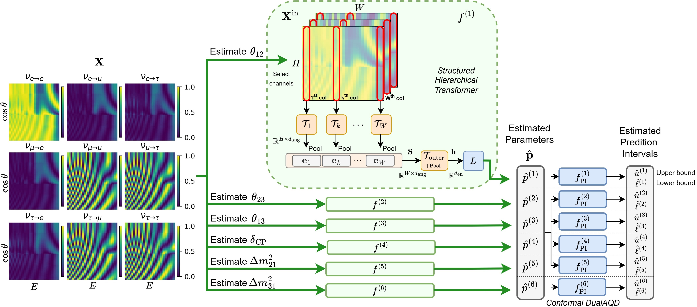

[](https://colab.research.google.com/github/GiorgioMorales/NuOscParam/blob/main/DemoSHTransformer.ipynb)
[](https://colab.research.google.com/github/GiorgioMorales/NuOscParam/blob/main/Demo_MCMC.ipynb)
[](https://huggingface.co/GiorgioMorales/NuInferenceModels)

# Neutrino Parameter Estimation from Oscillation Probability Maps

Neutrino oscillations encode fundamental information about neutrino masses and mixing parameters, offering a unique window into physics beyond the Standard Model.
Estimating these parameters from oscillation probability maps is, however, computationally challenging due to the maps’ high dimensionality and nonlinear dependence on the underlying physics.
In this work, we introduce a data-driven framework that reformulates atmospheric neutrino oscillation parameter inference as a supervised regression task over structured oscillation maps. 
We propose a hierarchical transformer architecture that explicitly models the two-dimensional structure of these maps, capturing angular dependencies at fixed energies and global correlations across the energy spectrum. 
To improve physical consistency, the model is trained using a surrogate simulation constraint that enforces agreement between the predicted parameters and the reconstructed oscillation patterns. 
Furthermore, we introduce a neural network-based uncertainty quantification mechanism that produces distribution-free prediction intervals with formal coverage guarantees. 


<figure style="display: flex; flex-direction: column; align-items: center;">
    
    <figcaption style="text-align: center; margin-top: 5px; font-style: italic;">
        Overview of the proposed neutrino oscillation parameters estimation.
    </figcaption>
</figure>


## Installation

The following libraries have to be installed:
* [Git](https://git-scm.com/download/) 
* [Pytorch](https://pytorch.org/get-started/locally/)

To install the package, run `pip install -q git+https://github.com/GiorgioMorales/NuOscParam` in the terminal.

## Download Models

### Option 1: Automatic download
After installing the `NuOscParam` library, run the following script on Python (or on the terminal without the "!"): 

```python
!hf download GiorgioMorales/NuInferenceModels \
  --repo-type model \
  --local-dir $(python -c "import NuOscParam; import os; print(os.path.join(os.path.dirname(NuOscParam.__file__), 'Models', 'saved_models'))") \
  --include "ModelType-HierarchicalTransformer/*"
```

### Option 2: Manual Download

If, instead, you cloned the repository, download the model manually from [HugginFace](https://huggingface.co/GiorgioMorales/NuInferenceModels/tree/main/ModelType-HierarchicalTransformer).
Then, copy and paste them into the `src/NuOscParam/Models/saved_models/ModelType-HierarchicalTransformer` [folder](/src/NuOscParam/Models/saved_models/ModelType-HierarchicalTransformer).

## Download Datasets

In case you need to retrain the models or simply access the datasets, download them from 
[HugginFace](https://huggingface.co/GiorgioMorales/NuInferenceModels/tree/main/Datasets).
Then, copy and paste them into the `src/NuOscParam/Models/saved_models/ModelType-HierarchicalTransformer` [folder](/src/NuOscParam/Data/Datasets).


## Usage

### Generate Neutrino Oscillation Maps

We use a simulator that generates 9 oscillation probability maps:

| Transition ↓ / Source → | $\nu_e$ (source) | $\nu_\mu$ (source) | $\nu_\tau$ (source) |
|--------------------------|------------------|--------------------|---------------------|
| **$\nu_e$ (detected)**  | $P(\nu_e \leftarrow \nu_e)$ | $P(\nu_e \leftarrow \nu_\mu)$ | $P(\nu_e \leftarrow \nu_\tau)$ |
| **$\nu_\mu$ (detected)** | $P(\nu_\mu \leftarrow \nu_e)$ | $P(\nu_\mu \leftarrow \nu_\mu)$ | $P(\nu_\mu \leftarrow \nu_\tau)$ |
| **$\nu_\tau$ (detected)** | $P(\nu_\tau \leftarrow \nu_e)$ | $P(\nu_\tau \leftarrow \nu_\mu)$ | $P(\nu_\tau \leftarrow \nu_\tau)$ |

In all cases, the $\nu$ oscillation parameters follow the order: `[theta12, theta23, theta13, delta_cp, m21, m31]`.

**Generate Maps Using Known Oscillation Parameters**

To use a exact simulator, initiate the `Simulator` class with the following parameters:

**Parameters**:

*   `mode`: It can take the values `vacuum`, which will use a simulator that produces $\nu$ oscillation maps in vacuum, or `earth` (default), which will use a simulator that produces $\nu$ oscillation maps after Earth-matter effect. 
*   `cropR`: It determines the number of rows ($\theta$) bins are used. Min:1, Max:120, Default: 80.
*   `cropC`: It determines the number of columns (energy) bins are used. Min:1, Max:120, Default: 30.


```python
from NuOscParam.utils import *
from NuOscParam.Data.DataRanges import *
from NuOscParam.Data.Simulator import Simulator
generator = Simulator(ranges=NEUTRINO_RANGES, mode='earth', device=torch.device("cuda" if torch.cuda.is_available() else "cpu"))
```

To get the actual maps given a set of $\nu$ oscillation parameters, we call the `get_maps` method.
The following example considers two sets of 6 $\nu$ oscillation parameters:

```python
import numpy as np

batch = np.array([[3.2434875e+01, 5.0723694e+01, 8.4253168e+00, 1.8559186e+02, 6.9126829e-05, 2.4357950e-03],
              [33.003803, 51.50117, 8.243288, 243.95, 7.993506e-05, 0.0024312385]])
maps = generator.get_maps(batch)
# Optionally, plot maps
for i in range(len(batch)):
    plot_osc_maps(maps[i, :, :, :].permute(1, 2, 0), title=f"Oscillation Maps. Sample {i+1}")
```

**Generate Random Maps**

To generate random $\nu$ oscillation maps and corresponding oscillation parameters, we use the
`OscIterableDataset` iterable class. Its parameters are the same as those from the `Simulator` class: 

```python
generator = iter(OscIterableDataset(ranges=NEUTRINO_RANGES, mode='earth',
                                    device=torch.device("cuda" if torch.cuda.is_available() else "cpu")))
```

To generate random maps, we call the `next` command iterably:

```python
X_test, Osc_params = [], []
n_samples = 3  # Generate three random sets of maps
for i in range(n_samples):
    xtest, _, osc_pars, _ = next(generator)  # Generate 1 sample
    X_test.append(xtest)
    Osc_params.append(osc_pars)
    # Plot oscillation maps    
    plot_osc_maps(input_image = xtest[0, :, :, :].permute(1, 2, 0), title=f"Oscillation Maps. Sample {i+1}")
X_test = torch.cat(X_test, dim=0)
```

### Proposed Neutrino Parameter Estimation from Oscillation Probability Maps

To use our $\nu$ oscillation parameter inference framework based on the use of Structured Hierarchical Transformers, 
call the `OscillationEstimator` class: 

```python
from NuOscParam.OscillationEstimator import OscillationEstimator
predictor = OscillationEstimator()
```

We use this class and the `predict` method to process a batch of $\nu$ oscillation maps:

**Parameters**:

*   `denormalize`: If `True`, the resulting oscillation parameters are given in their normal (operating) scale. If `False` (default), they're still normalized (between 0 and 1).
*   `uncertainty`: If `False`, only the point predictions are retrieved using the trained transformers. If `True`, the Conformal DualAQD is used in addition to produce 90\% prediction intervals. See the [Demo](https://github.com/GiorgioMorales/NuOscParam/blob/main/DemoSHTransformer.ipynb) for more details.

```python
pred_OscParams = predictor.predict(X_test, denormalize=True, uncertainty=True)
```


### Neutrino Parameter Estimation from Oscillation Probability Maps using MCMC

The `RunMCMC` class implements a delayed-acceptance MCMC procedure, which, in our paper, was used as a baseline method for comparison.
While it leads to better or comparable results as our transformer-based approach, its computational cost is substantially higher.


The (optional) **parameters** of the `RunMCMC` class, which are given as part of the `emcee_kwargs` parameter, are: 
*   `nwalkers`: The number of Goodman & Weare “walkers”. Default: `36`.
*   `nsteps`: The number of steps to run. Default: `900`.
*   `burn_in`: The number of “burn-in” steps. Default: `250`.
*   `budget_exact`: The "budget" or maximum number of times the exact simulator can be executed. Default: `80`.

The `evaluate` method is then used to evaluate a given batch of oscillation maps (see [Demo](https://colab.research.google.com/github/GiorgioMorales/NuOscParam/blob/main/Demo_MCMC.ipynb)):

```python
from NuOscParam.MCMC.RunMCMC import RunMCMC
executor = RunMCMC(mode="earth")
pred_OscParams = executor.evaluate(X_test)
```


# Citation
Use this Bibtex to cite this repository

```
@inproceedings{NuOscParam 
title={Neutrino Oscillation Parameter Estimation Using Structured Hierarchical Transformers (in review)},
author={Morales, Giorgio and Lehaut, Gregory and Vacheret, Antonin and Jurie, Fr\'{e}d\'{e}ric and Fadili, Jalal}, 
volume={}, 
number={}, 
journal={IEEE International Joint Conference on Neural Networks (IJCNN)}, 
year={2026}, 
month={}, 
pages={},
DOI={},
}
```